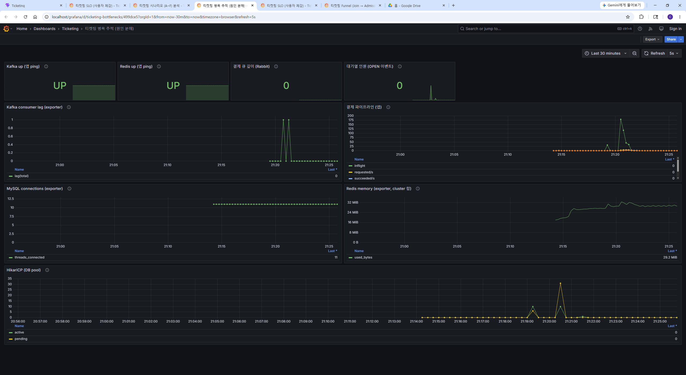
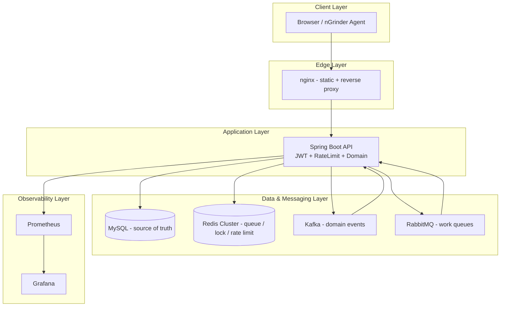

# 🎫 고성능 티켓팅 플랫폼 (High-Performance Ticketing Platform)

> **대기열 유입부터 대량의 좌석 경합, 비동기 결제 파이프라인**까지의 모든 퍼널을 단일 저장소에서 구현하고, nGrinder 부하 테스트 및 Observability 도구(Prometheus/Grafana)로 정밀 검증하는 엔드투엔드 인프라 프로젝트입니다.

기획 단계의 마이크로서비스·Gateway 설계와 현재 구현의 차이는 [flowchart_comparison.md](./flowchart_comparison.md)를 참고하세요.

<div align="center">

  
  
  
  
  
  

</div>

## 목차

1. [프로젝트 데모 및 대시보드 시각화](#-1-프로젝트-데모-및-대시보드-시각화)
2. [핵심 아키텍처 및 기술 스택](#️-2-핵심-아키텍처-및-기술-스택)
3. [백엔드 및 프론트엔드 특징](#️-3-백엔드-및-프론트엔드-특징)
4. [부하 테스트 시나리오 (A~F) 및 검증 지표](#-4-부하-테스트-시나리오-a--f-및-검증-지표)
5. [요청 처리 흐름 (정상 예매)](#-5-요청-처리-흐름-정상-예매-오케스트레이션)
6. [문제 해결 가이드 (Troubleshooting)](#️-6-문제-해결-가이드-troubleshooting)
7. [빠른 시작 (Quick Start)](#-7-빠른-시작-quick-start)
8. [관측성 아키텍처 및 문서](#-8-관측성-아키텍처-및-문서)

---

## 🎬 1. 프로젝트 데모 및 대시보드 시각화

### 🎥 데모 영상

<video src="assets/Ticketing_Test_Demo.mp4" controls width="100%" style="max-width:960px;border-radius:12px;background:#111;">
  브라우저가 video 태그를 지원하지 않습니다.
  <a href="https://drive.google.com/file/d/1L4A3smulnoks5xPSnGqh1EE2ObVDNoOs/view?usp=drive_link">Google Drive</a>에서 재생하거나
  <a href="assets/Ticketing_Test_Demo.mp4">Ticketing_Test_Demo.mp4</a>를 내려받으세요.
</video>

<div align="center">

[](https://drive.google.com/file/d/1L4A3smulnoks5xPSnGqh1EE2ObVDNoOs/view?usp=drive_link)

</div>

<sub>권장 시청 순서: 사용자 예매 → Ops 시나리오 F 실행 → Grafana <code>runId</code> 퍼널 · 저장소 영상은 Git LFS (<code>assets/Ticketing_Test_Demo.mp4</code>, [미디어 가이드](./docs/assets/README.md))</sub>

### 👤 사용자 예매 플로우 (`/`)

| 입장·좌석 선택 | 결제 완료 |
|:---:|:---:|
|  |  |

<sub>대기열 → 입장 토큰 → 좌석 <code>HELD</code> → Kafka/Rabbit 비동기 결제 → <code>SOLD</code></sub>

### 🖥️ Ops 부하 테스트 (`/ops`)


<sub>시나리오 A~F 실행 · runId · 결제 파이프라인 · 시나리오별 KPI · 좌석 히트맵(AVAILABLE / HELD / SOLD)</sub>

### 📊 Grafana 관측

#### SLO — 사용자 경험 (`ticketing-slo`)


<sub>HTTP TPS · 지연 p95/p99 · 5xx/429/409/404 오류율</sub>

#### Funnel — `runId` 단일 run 드릴다운 (`ticketing-funnel`)


<sub>Ops 상단 <code>runId</code>와 동일 값 입력 · 퍼널 Stat(Δ) · 예약 실패 사유 · 결제 outcomes</sub>

#### Bottleneck — 인프라·파이프라인 (`ticketing-bottlenecks`)



<sub>Kafka/Redis up · 결제 큐 depth · consumer lag · DB pool · Redis memory</sub>

> 시나리오 A~F별 Micrometer rate 패널은 **`ticketing-scenarios`** 대시보드 — 스크린샷은 `assets/티켓팅 시나리오.png` 참고.

---

## 🛠️ 2. 핵심 아키텍처 및 기술 스택

### 🏗️ 시스템 아키텍처 흐름도



### ⚡ 기술 스택 채택 배경 및 핵심 역할

| 기술 | 프로젝트 내 필요성 및 핵심 역할 |
|------|--------------------------------|
| **Spring Boot 3.3 + Java 21** | 티켓팅 도메인 API, 스케줄러, JPA, Actuator를 한 프레임워크로 통합. **가상 스레드**로 대량 동시 HTTP 처리 |
| **MySQL 8.4 + Flyway** | 좌석·예약·결제의 **최종 정합** Single Source of Truth, 스키마 버전 관리 자동화 |
| **Redis Cluster + Redisson** | 대기열 ZSET, 입장 토큰 TTL, 분산 락, 슬라이딩 윈도우 Rate Limit — DB 앞단에서 트래픽 **1차 차단·흡수** |
| **Apache Kafka** | 예약/취소 등 도메인 이벤트 버퍼링. API 스레드와 비동기 파이프라인 **격리** |
| **RabbitMQ 3** | 결제·알림 작업 큐. 워커 동시성 조절 및 **큐 깊이(Depth)** 관측 |
| **React + Vite** | 사용자 예매 플로우, Ops 실시간 폴링, 좌석 히트맵 |
| **nginx** | 정적 파일 + `/api`, `/ws`, `/actuator`, `/grafana` **단일 진입점** 역프록시 |
| **Prometheus + Grafana** | Micrometer 비즈니스 메트릭, SLI/SLO, 병목·퍼널 시계열 분석 |
| **nGrinder** | 시나리오 A~F 기반 **재현 가능한 고부하** 검증 |

### Redis 프로파일

| 환경 | 설정 |
|------|------|
| `docker compose up` (전체 스택) | `SPRING_PROFILES_ACTIVE=redis-cluster`, 6노드 + `redis-cluster-init` |
| 호스트에서 백엔드만 | 단일 Redis(6379) 또는 `REDIS_CLUSTER_NODES` 환경 변수 정렬 |

---

## 🗂️ 3. 백엔드 및 프론트엔드 특징

### 📂 백엔드 도메인 패키지 (Spring Boot 모놀리식)

기획서의 마이크로서비스 설계 요소를 **하나의 JVM** (`backend/`) 안 패키지로 통합했습니다.

| 패키지 | 핵심 역할 |
|--------|-----------|
| `auth`, `user`, `security` | JWT 발급·검증, Spring Security 기반 회원가입/로그인 |
| `event` | 공연·좌석 CRUD, `SeatViewCacheService` (좌석 조회 **5초 TTL**) |
| `ticket` | `QueueService`, `AdmissionScheduler`, `ReservationService`, `ReservationExpiryScheduler` |
| `payment` | Kafka → Rabbit 브릿지, PG 시뮬레이션 워커, `ReservationSettlementService` |
| `ratelimit` | Redis Lua 슬라이딩 윈도우 IP/유저 제한 (`RateLimitFilter`) |
| `messaging` | Kafka 토픽 프로듀서/컨슈머, RabbitMQ 큐 |
| `metrics`, `api` | Micrometer 비즈니스 카운터, WebSocket/REST 대시보드 |
| `ngrinder` | Ops 연동 시나리오 A~F, `runId` 주입, 결제 건수 기반 조기 종료 |

**핵심 설계**

- **대기열**: Redis `RScoredSortedSet` + 입장 토큰 버킷(TTL), 스케줄러 배치 입장
- **예매 동시성**: Redisson `tryLock`(fail-fast) + MySQL 비관적 락
- **결제 비동기화**: `ticket-reserved` → Rabbit `payment.queue` → 워커 → DB 정산
- **관측**: `X-LoadTest-RunId` + MDC 로그, Actuator → Prometheus

### 💻 프론트엔드 (React SPA + nginx)

| 구분 | 내용 |
|------|------|
| **스택** | React, Vite, Tailwind CSS, React Router, 2초 간격 API 폴링 |
| **사용자 UI** (`/`) | 로그인 → 공연 목록 → 대기열 폴링 → 좌석 예약 → 결제 진행 폴링 |
| **운영 UI** (`/ops`) | 시나리오 A~F 실행, 좌석 히트맵, run-metrics, Grafana 링크 |
| **역할 분담** | 정합·락·TTL은 백엔드. 프론트는 **상태 표시·부하 트리거·메트릭 Δ 근사** |

---

## 🎯 4. 부하 테스트 시나리오 (A ~ F) 및 검증 지표

부하 시나리오는 nGrinder Groovy (`load-tests/ngrinder/scripts/10_` ~ `15_`)와 Ops **`POST /api/dashboard/ngrinder/scenarios/start`** 로 실행합니다.

모든 실행에 **전역 `runId`** 가 발급되며, `X-LoadTest-RunId` 헤더와 로그 MDC로 단일 run을 추적합니다. (Prometheus 라벨로는 사용하지 않음 — 카디널리티 제한)

상세: [load-tests/ngrinder/README.md](./load-tests/ngrinder/README.md) · [docs/operations/load-test-runbook.md](./docs/operations/load-test-runbook.md)

### 📝 시나리오 요약 및 검증 목표

| ID | 시나리오명 | 부하 트래픽 패턴 | 중점 검증 목표 |
|:--:|------------|------------------|----------------|
| **A** | Open Run Spike (썬더링 허드) | VUser **동시** `joinQueue` → 첫 가용석 예약 | 오픈 직후 스파이크에서 대기열·입장·좌석 락 경합 |
| **B** | Hot Key / Lock | **1석**에 다수 동시 `reserve` | Redisson + DB 락으로 **정확히 1건** 성공 |
| **C** | Retry Storm | `GET /seats` 무차별 폴링 | runId당 IP 10/초·유저 5/초 → 429 **방어 신호** (Docker 전역 한도와 별개) |
| **D** | Zombie TTL | 예약 후 hold **60s**·결제 스킵·`sleepMs` 대기 | `ReservationExpiryScheduler` TTL 만료·좌석 **재가용** |
| **E** | Baseline Ticketing | 좌석 수 × `crowdMultiplier` 정상 퍼널 | 재고·점유율·결제 파이프라인 **기준선** |
| **F** | Integrated Random | A~E 마이크로 행동 랜덤 혼합 + 일회성 가입 | **복합 트래픽** 종합 내구도 |

### 🖥️ Ops Dashboard KPI (`scenarioExtraKpis`)

| 시나리오 | Ops 모니터링 주안점 | 비즈니스적 의미 |
|:--:|---------------------|-----------------|
| **A** | 대기열 진입 · 입장 토큰 · 좌석 락 실패 | 동시 유입 대비 입장 처리율, **첫 좌석 경쟁** 병목 |
| **B** | 좌석 락 실패 · 대기열 · 입장 | 핫키 1석에서 **fail-fast** 동작 |
| **C** | Rate limit 거절(429) · HTTP( runId ) · p99 | Redis 방어 레이어 + **읽기 부하** 영향 |
| **D** | TTL 만료 · 결제 요청 · 대기/드롭 | 좀비 예약 회수 · **파이프라인 잔류** |
| **E** | 판매 좌석 · 대기열 깊이 · 점유율 | 재고·매출 **정합 스냅샷** |
| **F** | 대기열~예약 시도/성공 · 락/실패 · HTTP | 혼합 부하 시 **최초 포화 퍼널** 식별 |

공통 KPI: 결제 성공/실패/처리중 — Kafka → Rabbit → 워커 파이프라인 건강도.

### 📊 Prometheus / Micrometer 커스텀 메트릭

메트릭 계약: [docs/observability/metrics-contract.md](./docs/observability/metrics-contract.md)

| 메트릭명 | 형태 | 의미 | 주요 시나리오 |
|----------|------|------|:-------------:|
| `ticketing_queue_entered_total` | Counter | `joinQueue` 성공 누적 | A, B, E, F |
| `ticketing_queue_admission_issued_total` | Counter | 입장 토큰 발급 누적 | A, B, E, F |
| `ticketing_reservation_seat_lock_failed_total` | Counter | Redisson 락 획득 실패 | A, B, F |
| `ticketing_ratelimit_rejected_total` | Counter | 429 차단 (`scope` 라벨) | C, F |
| `http_server_requests_seconds_*` | Timer | TPS, p95/p99, 4xx/5xx | 전체 |
| `ticketing_reservation_expired_total` | Counter | hold TTL 만료·회수 | D |
| `ticketing_payment_requested_total` 등 | Counter/Gauge | 결제 파이프라인 | D, E, F |
| `ticketing_integrity_mismatch_*` | Gauge | 정합 불일치 (**0이 정상**) | 전체 |

**runId 드릴다운**: `GET /api/dashboard/run-metrics?runId=...` · Grafana Funnel `runId` 변수 · Loki/액세스 로그 MDC.

**증분(Δ) 측정**: `scripts/run-scenarios-metrics.ps1` 또는 `business-metrics` 전후 스냅샷. 짧은 구간은 Grafana `rate()` 권장.

---

## 🔁 5. 요청 처리 흐름 (정상 예매 오케스트레이션)

1. **인증** — `POST /api/auth/login` → JWT 발급
2. **대기열** — `POST /api/events/{id}/queue` → Redis Sorted Set 등록 → `GET .../queue/me` 폴링
3. **순차 입장** — `AdmissionScheduler`가 배치로 토큰 발급(TTL) → 클라이언트 `admissionToken` 확보
4. **좌석 선점** — `POST .../reservations` → Redisson 락 → DB `HELD` → Kafka `ticket-reserved`
5. **비동기 결제** — Kafka Consumer → Rabbit `payment.queue` → `PaymentWorkerConsumer` → MySQL `CONFIRMED`/`SOLD`
6. **관측** — 단계별 Micrometer 카운터 → Ops / Grafana

Rate limit은 **`RateLimitFilter`** (Redis Lua). 가입/로그인은 일반 API와 **별도 상한**입니다.

---

## 🛠️ 6. 문제 해결 가이드 (Troubleshooting)

상세 이력: [docs/operations/troubleshooting.md](./docs/operations/troubleshooting.md) · [docs/changelog/](./docs/changelog/)

| 관측 증상 | 원인 후보 | 확인·조치 순서 |
|-----------|-----------|----------------|
| nGrinder **`script should exist`** | 스크립트 미업로드 · 볼륨 초기화 | `.\load-tests\ngrinder\upload-scripts.ps1` 재실행 (`down -v` 후 **필수**) |
| **`stop_by_error`** (Groovy) | 인증 실패 · `eventId` 누락 · 429 | Controller 로그 · `beforeThread` · `RATE_LIMIT_*` 완화 |
| 시나리오 **C/F 지표 0** | 저부하 · `scriptRevision: -1` | `vusers` · `testDurationSec` 상향 · 스크립트 업로드 확인 |
| **F** 매진 후에도 장시간 실행 / 히트맵 불일치 | `/seats` 캐시 · `baseUrl` 불일치 | `GET .../seats?refresh=true` · 단일 백엔드·스크립트 재배포 |
| Ops **결제 Δ 정체** | Rabbit 적체 · progress 타임아웃 | `:15672` 큐 depth · `paymentWorkersSleeping` · Rate limit |
| **`paymentRequested` 목표 미달** | 실행 시간 상한 · 좌석 SOLD 고정 | 최신 `05_all_in_one.groovy`(좌석 순환) 업로드 |
| Redis **「클러스터 비활성」** | `redis-cluster-init` Exited | **정상** — `redis-node-1`~`6` Running 확인 |
| Grafana **Redis up = 0** | PING 실패 · 프로파일 불일치 | `redis-cluster` · `REDIS_CLUSTER_NODES` |
| **`admin is logined` 로그 반복** | Ops 상태 API 폴링 | 정상 동작; 노이즈 제거 시 nGrinder 로그 레벨 WARN |
| Micrometer **누적 급감** | JVM 재시작 · LB 인스턴스 혼선 | 단일 인스턴스 검증 · `sum by (instance)` |
| Prometheus **시계열 유실** | TSDB 볼륨 미마운트 | compose 재생성 시 초기화 — 장기 보관 시 볼륨 추가 검토 |

**재현 시 첨부 권장**: nGrinder 테스트 로그, `X-LoadTest-RunId` access 로그, `run-metrics`, `business-metrics` 전후 스냅샷.

---

## 🚀 7. 빠른 시작 (Quick Start)

### 📌 사전 요구 사항

- Docker Engine + Docker Compose v2
- (호스트 직접 빌드) JDK 21, Maven 3.9+, Node.js 22+

### 🐳 전체 스택 기동

```bash
docker compose up -d --build
```

MySQL 헬스체크 후 백엔드가 기동합니다. `redis-cluster-init`은 토폴로지 결속 후 **Exited(0)이 정상**입니다.

### 🌐 통합 엔드포인트

| 서비스 | URL | 인증 | 용도 |
|--------|-----|------|------|
| 사용자 웹 앱 | http://localhost | 회원가입 | 엔드유저 예매 플로우 |
| **Ops** | http://localhost/ops | 로그인 | 부하·히트맵·run-metrics |
| 백엔드 API | http://localhost:8080 | — | REST · Actuator 직접 |
| Prometheus | http://localhost:9090 | — | Raw 메트릭 · PromQL |
| Grafana | http://localhost/grafana | `admin` / `admin` | SLO · 병목 · 퍼널 |
| nGrinder | http://localhost:19080 | `admin` / `admin` | VUser · 에이전트 |
| RabbitMQ | http://localhost:15672 | `guest` / `guest` | 결제 큐 depth |

### 🌱 초기 데이터 및 환경 리셋

- DB가 비어 있으면 `SeedDataRunner`가 **공연 1건 + 좌석 100석** 생성. 사용자는 시드하지 않음.
- UI 회원가입 또는 부하 스크립트가 계정을 생성합니다.

```bash
docker compose down -v
docker compose up -d --build
.\load-tests\ngrinder\upload-scripts.ps1
```

### 로컬 개발 (IDE)

1. 인프라만 Compose: `mysql`, `redis-node-*`, `redis-cluster-init`, `zookeeper`, `kafka`, `rabbitmq`
2. 백엔드: `cd backend && mvn spring-boot:run`
3. 프론트: `cd frontend && npm install && npm run dev` — Vite가 `/api`, `/ws`를 `localhost:8080`으로 프록시

---

## 📊 8. 관측성 아키텍처 및 문서

### 📈 Grafana 대시보드 역할

| 대시보드 | 경로 | 모니터링 목적 |
|----------|------|---------------|
| **SLO** | `/grafana/d/ticketing-slo/ticketing-slo` | HTTP TPS, p95/p99, 5xx/429 |
| **Bottleneck** | `/grafana/d/ticketing-bottlenecks/ticketing-bottlenecks` | Kafka/Redis up, 큐·결제 파이프라인, lag, MySQL, Redis, Hikari |
| **Scenarios** | `/grafana/d/ticketing-scenarios/ticketing-scenarios` | A~F Micrometer rate |
| **Funnel** | `/grafana/d/ticketing-funnel/ticketing-funnel` | Join → Admission → Reserve → Pay, `runId` |

**Ops vs Grafana**

- **Ops** — 단일 Run 조작, 즉시 KPI, 좌석 히트맵
- **Grafana** — 시계열 추세, 인프라 깊이, SLO

### 📁 저장소 구조

```
ticketing_server/
├── assets/                  # README 스크린샷 (데모 캡처)
├── backend/                 # Spring Boot API, Flyway, 도메인
├── frontend/                # React SPA, nginx (Docker)
├── load-tests/ngrinder/     # 시나리오 A~F Groovy, upload-scripts.ps1
├── docker/                  # Prometheus, Grafana, RabbitMQ 설정
└── docs/                    # 기술 문서 (observability / operations / changelog)
    ├── assets/              # (선택) demo.mp4 · screenshots/ 영문 파일명
    ├── observability/
    ├── operations/
    └── changelog/
```

### 📚 상세 문서

전체 색인: **[docs/README.md](./docs/README.md)**

| 문서 | 내용 |
|------|------|
| [기획서.md](./기획서.md) | 목표 아키텍처·동시성 전략 |
| [flowchart_comparison.md](./flowchart_comparison.md) | 기획 vs 현재 구현 |
| [docs/observability/metrics-contract.md](./docs/observability/metrics-contract.md) | 지표 이름·의미·알람 |
| [docs/observability/grafana-and-prometheus.md](./docs/observability/grafana-and-prometheus.md) | Grafana 4종·runId·Prometheus |
| [docs/operations/load-test-runbook.md](./docs/operations/load-test-runbook.md) | 시나리오 A~F·Δ 측정 |
| [docs/operations/ops-dashboard.md](./docs/operations/ops-dashboard.md) | `/ops`·`business-metrics` |
| [docs/operations/troubleshooting.md](./docs/operations/troubleshooting.md) | 증상별 조치 |
| [docs/changelog/](./docs/changelog/) | 세션별 변경 아카이브 |
