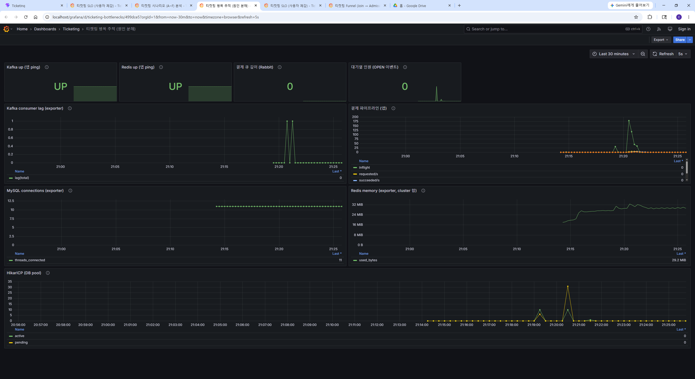
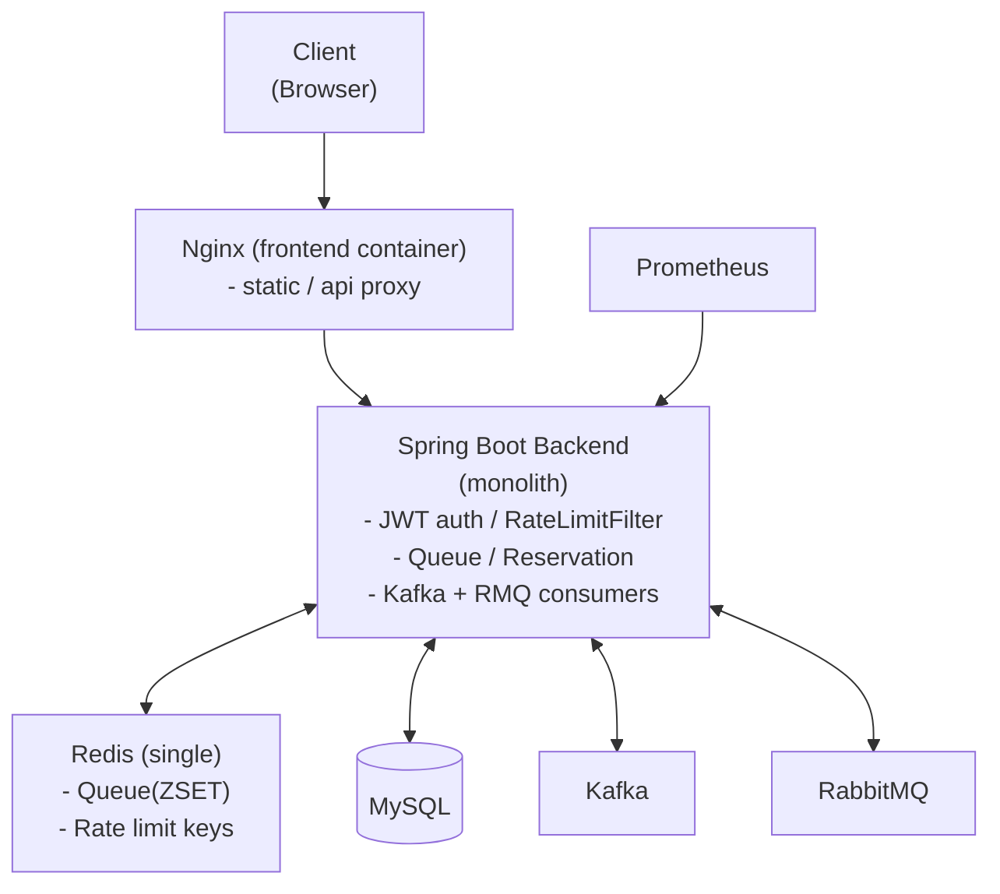
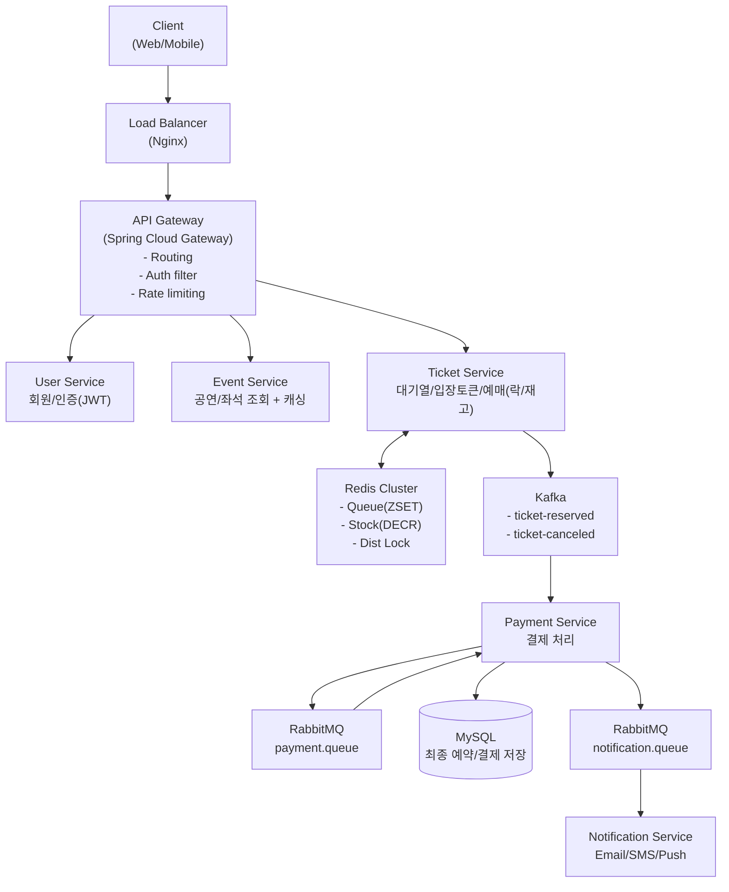
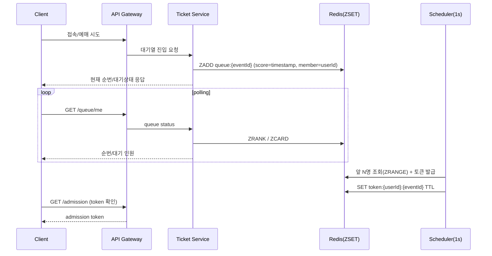

# 🎫 고성능 티켓팅 플랫폼

> **대기열 유입부터 대량의 좌석 경합, 비동기 결제 파이프라인**까지의 모든 퍼널을 단일 저장소에서 구현하고, nGrinder 부하 테스트 및 Observability 도구(Prometheus/Grafana)로 정밀 검증하는 엔드투엔드 인프라 프로젝트입니다.

  
  
  
  
  
  

## 목차

1. [프로젝트 데모 및 대시보드 시각화](#-1-프로젝트-데모-및-대시보드-시각화)
2. [핵심 아키텍처 및 기술 스택](#️-2-핵심-아키텍처-및-기술-스택)
3. [부하 테스트 (시나리오 A~F)](#-3-부하-테스트-시나리오-af)

---

## 🎬 1. 프로젝트 데모 및 대시보드 시각화

### 🎥 데모 영상

<video src="assets/Ticketing_Test_Demo.mp4" controls width="100%" style="max-width:960px;border-radius:12px;background:#111;">
  브라우저가 video 태그를 지원하지 않습니다.
  <a href="https://drive.google.com/file/d/1L4A3smulnoks5xPSnGqh1EE2ObVDNoOs/view?usp=drive_link">Google Drive</a>에서 재생하거나
  <a href="assets/Ticketing_Test_Demo.mp4">Ticketing_Test_Demo.mp4</a>를 내려받으세요.
</video>

### 👤 사용자 예매 플로우 (`/`)

| 입장·좌석 선택 | 결제 완료 |
|:---:|:---:|
|  |  |

### 🖥️ Ops 부하 테스트 (`/ops`)

### 📊 Grafana 관측

#### SLO — 사용자 경험 (`ticketing-slo`)

#### Funnel — `runId` 단일 run 드릴다운 (`ticketing-funnel`)

#### Bottleneck — 인프라·파이프라인 (`ticketing-bottlenecks`)

---

## 🛠️ 2. 핵심 아키텍처 및 기술 스택

### 전체 시스템 구조

```mermaid
flowchart TB
  C["Client<br/>(Browser)"] --> N["Nginx (frontend container)<br/>- static / api proxy"]
  N --> B["Spring Boot Backend<br/>(monolith)<br/>- JWT auth / RateLimitFilter<br/>- Queue / Reservation<br/>- Kafka + RMQ consumers"]

  B <--> R["Redis (single)<br/>- Queue(ZSET)<br/>- Rate limit keys"]
  B <--> DB[("MySQL")]
  B <--> K["Kafka"]
  B <--> RMQ["RabbitMQ"]

  P["Prometheus"] --> B
```

### 전체 트래픽 흐름

```mermaid
flowchart TB
  C["Client<br/>(Web/Mobile)"] --> LB["Load Balancer<br/>(Nginx)"]
  LB --> GW["API Gateway<br/>(Spring Cloud Gateway)<br/>- Routing<br/>- Auth filter<br/>- Rate limiting"]

  GW --> US["User Service<br/>회원/인증(JWT)"]
  GW --> ES["Event Service<br/>공연/좌석 조회 + 캐싱"]
  GW --> TS["Ticket Service<br/>대기열/입장토큰/예매(락/재고)"]

  TS <--> RC["Redis Cluster<br/>- Queue(ZSET)<br/>- Stock(DECR)<br/>- Dist Lock"]

  TS --> K["Kafka<br/>- ticket-reserved<br/>- ticket-canceled"]
  K --> PS["Payment Service<br/>결제 처리"]
  PS --> RMQ["RabbitMQ<br/>payment.queue"]
  RMQ --> PS

  PS --> DB[("MySQL<br/>최종 예약/결제 저장")]

  PS --> RMQ2["RabbitMQ<br/>notification.queue"]
  RMQ2 --> NS["Notification Service<br/>Email/SMS/Push"]
```

### 시퀀스 다이어그램

```mermaid
sequenceDiagram
  participant Client as Client
  participant GW as API Gateway
  participant TS as Ticket Service
  participant Redis as Redis(ZSET)
  participant Sch as Scheduler(1s)

  Client->>GW: 접속/예매 시도
  GW->>TS: 대기열 진입 요청
  TS->>Redis: ZADD queue:{eventId} (score=timestamp, member=userId)
  TS-->>Client: 현재 순번/대기상태 응답

  loop polling
    Client->>GW: GET /queue/me
    GW->>TS: queue status
    TS->>Redis: ZRANK / ZCARD
    TS-->>Client: 순번/대기 인원
  end

  Sch->>Redis: 앞 N명 조회(ZRANGE) + 토큰 발급
  Sch->>Redis: SET token:{userId}:{eventId} TTL
  Client->>GW: GET /admission (token 확인)
  GW-->>Client: admission token
```

### ⚡ 기술 스택 채택 배경 및 핵심 역할

| 기술 | 핵심 역할 |
|------|-----------|
| **Spring Boot 3.3 + Java 21** | API·스케줄러·JPA 통합, 가상 스레드로 고동시 HTTP |
| **MySQL 8.4 + Flyway** | 좌석·예약·결제 SSOT, 스키마 버전 관리 |
| **Redis Cluster + Redisson** | 대기열·토큰 TTL·분산 락·Rate Limit |
| **Apache Kafka** | 예약 등 이벤트 버퍼, API와 비동기 파이프라인 분리 |
| **RabbitMQ 3** | 결제 워크 큐, 워커 동시성·큐 depth 관측 |
| **React + Vite** | 예매 UI, Ops 폴링·좌석 히트맵 |
| **nginx** | 정적·`/api`·`/ws` 등 단일 진입 역프록시 |
| **Prometheus + Grafana** | 비즈니스 메트릭, SLO·퍼널·병목 분석 |
| **nGrinder** | 시나리오 A~F 재현 가능 부하 검증 |

---

## 🎯 3. 부하 테스트 (시나리오 A~F)

nGrinder 스크립트는 `load-tests/ngrinder/scripts/10_` ~ `15_`에 있고, `/ops`에서 돌리거나 `POST /api/dashboard/ngrinder/scenarios/start`로 띄울 수 있습니다.  
실행마다 `runId`가 하나 붙고, 요청 헤더 `X-LoadTest-RunId`랑 로그 MDC로 해당 run만 추적합니다.

### 📝 시나리오

| ID   | 이름       | 뭐 하는지                                              | 보려는 것                                                          |
|:----:|------------|--------------------------------------------------------|--------------------------------------------------------------------|
| **A** | 오픈 스파이크 | VUser가 한꺼번에 `joinQueue` 후 첫 빈 좌석 예약         | 오픈 직후 대기열·입장·좌석 락이 버티는지 확인                       |
| **B** | 핫키 락     | 좌석 1개에 `reserve` 동시에 요청                        | Redisson + DB 락으로 성공 1건만 나오는지 확인                      |
| **C** | 폴링 폭주   | `GET /seats` 반복적으로 호출                            | 429 나오는지 확인                                                  |
| **D** | 좀비 TTL   | 예약만 하고 60s hold, 결제는 진행하지 않음              | `ReservationExpiryScheduler`가 만료 후 좌석 풀어주는지 확인        |
| **E** | 베이스라인  | 일반 예매 테스트                                        | 재고·점유·결제 파이프라인 기준 수치 잡기                           |
| **F** | 랜덤 믹스   | A~E 섞어서 테스트                                       | 여러 패턴 섞였을 때 가장 문제되는 시나리오 확인                    |

### 📊 메트릭

이름·의미 정리: [metrics-contract](./docs/observability/metrics-contract.md)

| 메트릭                                              | 타입          | 설명                    | 주로 쓰는 시나리오 |
|-----------------------------------------------------|---------------|-------------------------|:------------------:|
| `ticketing_queue_entered_total`                     | Counter       | `joinQueue` 성공        | A, B, E, F         |
| `ticketing_queue_admission_issued_total`            | Counter       | 입장 토큰 발급          | A, B, E, F         |
| `ticketing_reservation_seat_lock_failed_total`      | Counter       | Redisson 락 실패        | A, B, F            |
| `ticketing_ratelimit_rejected_total`                | Counter       | 429 (`scope`)           | C, F               |
| `http_server_requests_seconds_*`                    | Timer         | TPS, p95/p99, 4xx/5xx   | 전체               |
| `ticketing_reservation_expired_total`               | Counter       | hold 만료               | D                  |
| `ticketing_payment_requested_total` 등              | Counter/Gauge | 결제 쪽                 | D, E, F            |
| `ticketing_integrity_mismatch_*`                    | Gauge         | 정합 깨짐 (0이어야 함)  | 전체               |

`runId`로 확인할 때는 `GET /api/dashboard/run-metrics?runId=...`, Grafana Funnel의 `runId` 변수를 채워 사용합니다.  
전후 비교는 `scripts/run-scenarios-metrics.ps1`이나 `business-metrics` 스냅샷, 짧은 구간은 Grafana `rate()`가 더 유용합니다.
