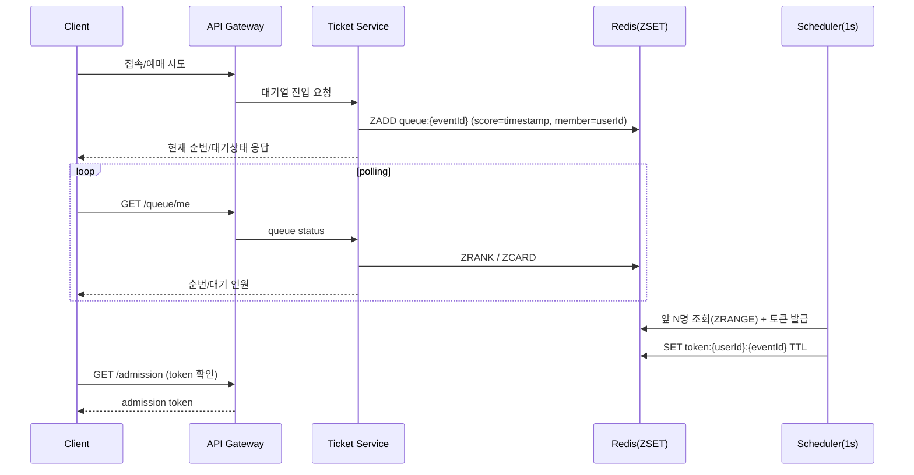
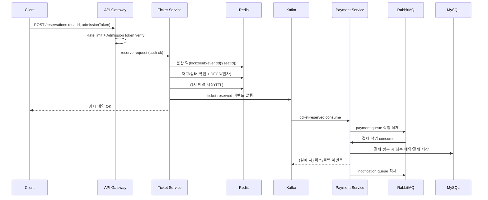
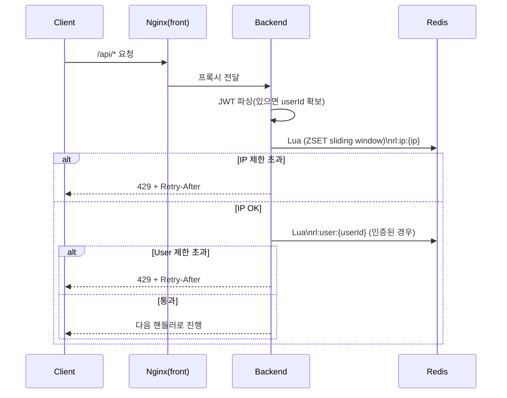

# Flowchart Comparison (Before vs After)

이 문서는 `기획서.md`에 정의된 목표 흐름(구현 전)과, 현재 레포(`ticketing_server`)의 실제 구현/구성(구현 후)을 **플로우 차트로 비교**합니다.

---

## 구현 전 Flow Chart (기획서 기준 목표 흐름)

### 전체 트래픽/요청 흐름 (Gateway + Rate Limit 포함)

```mermaid
flowchart TB
  C[Client\nWeb/Mobile] --> LB[Load Balancer\n(Nginx)]
  LB --> GW[API Gateway\n(Spring Cloud Gateway)\n- Routing\n- Auth filter\n- Rate limiting]

  GW --> US[User Service\n회원/인증(JWT)]
  GW --> ES[Event Service\n공연/좌석 조회 + 캐싱]
  GW --> TS[Ticket Service\n대기열/입장토큰/예매(락/재고)]

  TS <--> RC[Redis Cluster\n- Session/Token cache\n- Queue(ZSET)\n- Stock(DECR)\n- Distributed Lock]

  TS --> K[Kafka\n- ticket-reserved\n- ticket-canceled\n- queue-enter]
  K --> PS[Payment Service\n결제 처리]
  PS --> RMQ[RabbitMQ\npayment.queue]
  RMQ --> PS

  PS --> DB[(MySQL\n최종 예약/결제 저장)]

  PS --> RMQ2[RabbitMQ\nnotification.queue]
  RMQ2 --> NS[Notification Service\nEmail/SMS/Push]
```

### 대기열 처리 흐름 (Queue Flow)



### 예매 처리 흐름 (Reservation Flow)



---

## 구현 후 Flow Chart (현재 레포 실제 동작)

> 주의: 현재 레포는 **단일 Spring Boot 백엔드**가 User/Event/Ticket/Payment/Notification 역할을 모두 포함하고, `docker-compose.yml`은 **단일 Redis**를 기본으로 기동합니다.  
> Redis Cluster는 `docker-compose.redis-cluster.yml`로 별도 기동 가능하지만, 메인 백엔드가 기본으로 붙는 구성은 단일 Redis입니다.

### 전체 트래픽/요청 흐름 (현재: Nginx(프론트) → 백엔드 + Backend Rate Limit)

```mermaid
flowchart TB
  C[Client\nBrowser] --> N[Nginx (frontend container)\n- static\n- /api proxy\n- /ws proxy]
  N --> B[Spring Boot Backend\n(monolith)\n- JWT auth filter\n- RateLimitFilter (Redis sliding window)\n- Queue/Admission\n- Reservation/Lock/Stock\n- Kafka + RabbitMQ consumers]

  B <--> R[Redis (single)\n- Queue(ZSET)\n- Admission token TTL\n- Rate limit keys]
  B <--> DB[(MySQL)]
  B <--> K[Kafka]
  B <--> RMQ[RabbitMQ]

  P[Prometheus] --> B
```

### Rate Limiting 흐름 (현재: 백엔드 필터에서 IP/User 단위 제한)



### nGrinder 부하테스트 실행 흐름 (현재 레포 기반)

```mermaid
flowchart LR
  NGU[nGrinder Controller\nhttp://localhost:9080] --> NGA[nGrinder Agent\n(script runner)]
  NGA -->|baseUrl=http://host.docker.internal:8080| B[Backend API]
  B --> R[Redis]
  B --> DB[(MySQL)]
  B --> K[Kafka]
  B --> RMQ[RabbitMQ]
```

---

## 핵심 차이 요약

- **Gateway 위치**
  - **구현 전(기획)**: Gateway에서 라우팅/인증필터/Rate Limit 수행
  - **구현 후(현재)**: 별도 Gateway 없이 **백엔드 필터(`RateLimitFilter`)**에서 Rate Limit 수행

- **서비스 분리**
  - **구현 전(기획)**: User/Event/Ticket/Payment/Notification 마이크로서비스 분리
  - **구현 후(현재)**: **단일 Spring Boot 백엔드(모놀리식)** 내부에서 기능 구현 (Kafka/RMQ는 내부 consumer/producer로 연결)

- **Redis 구성**
  - **구현 전(기획)**: Redis Cluster
  - **구현 후(현재)**: 기본은 단일 Redis(`docker-compose.yml`), 클러스터는 `docker-compose.redis-cluster.yml`로 별도 구동 가능

- **부하테스트**
  - **구현 전(기획)**: k6/JMeter 언급(또는 기타)
  - **구현 후(현재)**: `load-tests/ngrinder/scripts/*.groovy` 기반으로 nGrinder 실행/검증 가능

---

## 참고 파일

- `기획서.md`
- `docker-compose.yml`
- `docker-compose.redis-cluster.yml`
- `load-tests/ngrinder/README.md`
- `load-tests/ngrinder/scripts/01_comprehensive.groovy`
- `load-tests/ngrinder/scripts/02_concurrency.groovy`
- `load-tests/ngrinder/scripts/03_load.groovy`
- `load-tests/ngrinder/scripts/04_data_integrity.groovy`

