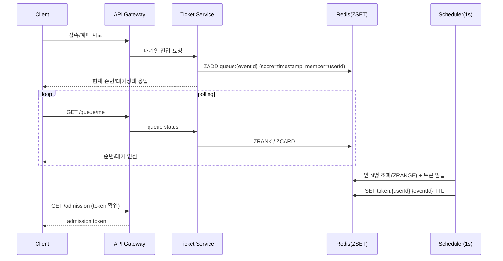
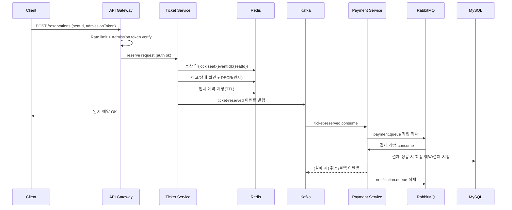
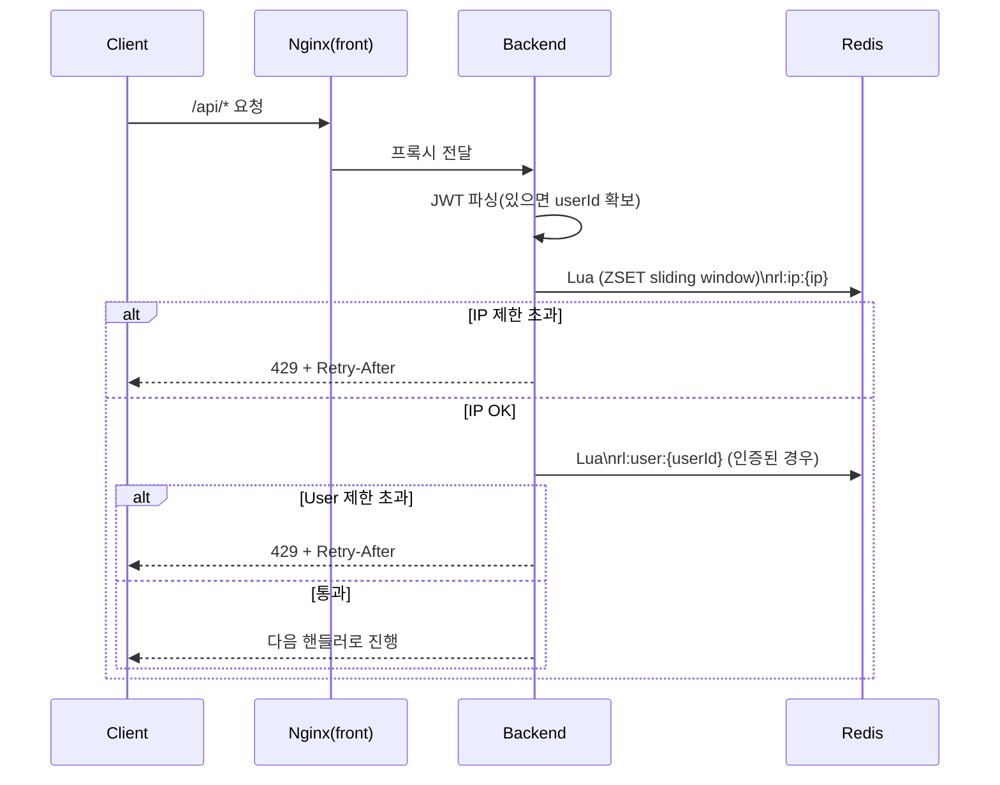

# Flowchart Comparison (Before vs After)

이 문서는 `기획서.md`에 정의된 목표 흐름(구현 전)과, 현재 레포(`ticketing_server`)의 실제 구현/구성(구현 후)을 **플로우 차트로 비교**합니다.

---

## 구현 전 Flow Chart (기획서 기준 목표 흐름)

### 전체 트래픽/요청 흐름 (Gateway + Rate Limit 포함)

```mermaid
flowchart TB
  C[Client\nWeb/Mobile] --> LB[Load Balancer\n(Nginx)]
  LB --> GW[API Gateway\n(Spring Cloud Gateway)\n- Routing\n- Auth filter\n- Rate limiting]

  GW --> US[User Service\n회원/인증(JWT)]
  GW --> ES[Event Service\n공연/좌석 조회 + 캐싱]
  GW --> TS[Ticket Service\n대기열/입장토큰/예매(락/재고)]

  TS <--> RC[Redis Cluster\n- Session/Token cache\n- Queue(ZSET)\n- Stock(DECR)\n- Distributed Lock]

  TS --> K[Kafka\n- ticket-reserved\n- ticket-canceled\n- queue-enter]
  K --> PS[Payment Service\n결제 처리]
  PS --> RMQ[RabbitMQ\npayment.queue]
  RMQ --> PS

  PS --> DB[(MySQL\n최종 예약/결제 저장)]

  PS --> RMQ2[RabbitMQ\nnotification.queue]
  RMQ2 --> NS[Notification Service\nEmail/SMS/Push]
```

### (텍스트 그림) 전체 트래픽/요청 흐름 (Before, ASCII)

> Mermaid를 그대로 노출하지 않고 문서에서 바로 볼 수 있도록 ASCII로 함께 제공합니다.

```
┌────────────────────────────── 구현 전 (기획) ──────────────────────────────┐
│ [Client: Web/Mobile]                                                     │
│          │                                                               │
│          v                                                               │
│ [Load Balancer (Nginx)]                                                  │
│          │                                                               │
│          v                                                               │
│ [API Gateway (Spring Cloud Gateway)]                                     │
│  - Routing / Auth filter / Rate limiting                                 │
│      │              │                         │                          │
│      v              v                         v                          │
│ [User Service]   [Event Service]        [Ticket Service]                 │
│  JWT 인증         공연/좌석+캐싱          대기열/토큰/예매(락/재고)         │
│                                        │            ^                    │
│                                        │            │                    │
│                                        v            │                    │
│                              [Redis Cluster] <──────┘                    │
│                               Queue(ZSET), Token cache,                  │
│                               Stock(DECR), Dist Lock                     │
│                                        │                                 │
│                                        v                                 │
│                                     [Kafka]                              │
│                           ticket-reserved/canceled/...                    │
│                                        │                                 │
│                                        v                                 │
│                               [Payment Service]                          │
│                                  결제 처리                               │
│                             ┌─────────┴─────────┐                        │
│                             v                   v                        │
│                   [RabbitMQ payment.queue]     [MySQL]                   │
│                       (작업 적재/소비)         최종 예약/결제 저장         │
│                             │                                            │
│                             v                                            │
│                 [RabbitMQ notification.queue]                             │
│                             │                                            │
│                             v                                            │
│                   [Notification Service]                                  │
│                    Email / SMS / Push                                     │
└───────────────────────────────────────────────────────────────────────────┘
```

### 대기열 처리 흐름 (Queue Flow)



### 예매 처리 흐름 (Reservation Flow)



---

## 구현 후 Flow Chart (현재 레포 실제 동작)

> 주의: 현재 레포는 **단일 Spring Boot 백엔드**가 User/Event/Ticket/Payment/Notification 역할을 모두 포함하고, `docker-compose.yml`은 **단일 Redis**를 기본으로 기동합니다.  
> Redis Cluster는 `docker-compose.redis-cluster.yml`로 별도 기동 가능하지만, 메인 백엔드가 기본으로 붙는 구성은 단일 Redis입니다.

### 전체 트래픽/요청 흐름 (현재: Nginx(프론트) → 백엔드 + Backend Rate Limit)

```mermaid
flowchart TB
  C[Client\nBrowser] --> N[Nginx (frontend container)\n- static\n- /api proxy\n- /ws proxy]
  N --> B[Spring Boot Backend\n(monolith)\n- JWT auth filter\n- RateLimitFilter (Redis sliding window)\n- Queue/Admission\n- Reservation/Lock/Stock\n- Kafka + RabbitMQ consumers]

  B <--> R[Redis (single)\n- Queue(ZSET)\n- Admission token TTL\n- Rate limit keys]
  B <--> DB[(MySQL)]
  B <--> K[Kafka]
  B <--> RMQ[RabbitMQ]

  P[Prometheus] --> B
```

### (텍스트 그림) 전체 트래픽/요청 흐름 (After, ASCII)

```
┌────────────────────────────── 구현 후 (현재 레포) ─────────────────────────────┐
│ [Client: Browser]                                                          │
│          │                                                                  │
│          v                                                                  │
│ [Nginx (frontend container)]                                                │
│  - static / /api proxy / /ws proxy                                          │
│          │                                                                  │
│          v                                                                  │
│ [Spring Boot Backend (monolith)]                                            │
│  - JWT auth filter                                                          │
│  - RateLimitFilter (Redis sliding window)                                   │
│  - Queue/Admission + Reservation/Lock/Stock                                  │
│  - Kafka + RabbitMQ consumers                                                │
│    │        │        │         │                                             │
│    │        │        │         │                                             │
│    v        v        v         v                                             │
│ [Redis]    [MySQL]  [Kafka]   [RabbitMQ]                                     │
│ (single)                                                                     │
│  - Queue(ZSET)                                                               │
│  - Admission token TTL                                                       │
│  - Rate limit keys                                                           │
│                                                                              │
│ [Prometheus] ───────────────────────────────────────────────► (Backend)      │
└──────────────────────────────────────────────────────────────────────────────┘
```

### Rate Limiting 흐름 (현재: 백엔드 필터에서 IP/User 단위 제한)



### (텍스트 그림) Rate Limiting 흐름 (After, ASCII)

```
[Client] -> [Nginx(front)] -> [Backend]
                             |
                             | (1) JWT 파싱(있으면 userId 확보)
                             v
                           [Redis]
                             |
                             | Lua: rl:ip:{ip} (sliding window)
                             v
                 +---------------------------+
                 | IP 제한 초과?             |
                 +---------------------------+
                   | Yes                | No
                   v                    v
     [429 + Retry-After 응답]     Lua: rl:user:{userId} (인증된 경우)
                                      |
                                      v
                          +---------------------------+
                          | User 제한 초과?           |
                          +---------------------------+
                            | Yes                | No
                            v                    v
              [429 + Retry-After 응답]      [다음 핸들러로 진행]
```

### nGrinder 부하테스트 실행 흐름 (현재 레포 기반)

```mermaid
flowchart LR
  NGU[nGrinder Controller\nhttp://localhost:19080] --> NGA[nGrinder Agent\n(script runner)]
  NGA -->|baseUrl=http://host.docker.internal:8080| B[Backend API]
  B --> R[Redis]
  B --> DB[(MySQL)]
  B --> K[Kafka]
  B --> RMQ[RabbitMQ]
```

### (텍스트 그림) nGrinder 부하테스트 실행 흐름 (After, ASCII)

```
[nGrinder Controller (localhost:19080)]
                |
                v
[nGrinder Agent (script runner)]
                |
                | baseUrl=http://host.docker.internal:8080
                v
[Backend API] ---> [Redis]
     |            [MySQL]
     |            [Kafka]
     └----------> [RabbitMQ]
```

---

## 이미지(PNG) 버전 (요청: C)

현재 이 채팅에서 선택된 모델은 **이미지 생성 기능이 비활성화**되어 있어, 문서에 바로 PNG를 생성/첨부할 수 없습니다.

- PNG를 생성해 `flowchart_comparison.md`에 붙이려면, **이미지 생성 가능한 모델로 전환** 후 제가 아래 파일들을 만들어서 링크/첨부까지 마무리할게요.
  - `docs/flowchart_before.png` (구현 전 전체 흐름)
  - `docs/flowchart_after.png` (구현 후 전체 흐름)
  - `docs/flowchart_rate_limit_after.png` (Rate limit 흐름)

PNG가 준비되면, 이 문서의 해당 섹션에 아래처럼 삽입될 예정입니다.

```md


```

---

## 핵심 차이 요약

- **Gateway 위치**
  - **구현 전(기획)**: Gateway에서 라우팅/인증필터/Rate Limit 수행
  - **구현 후(현재)**: 별도 Gateway 없이 **백엔드 필터(`RateLimitFilter`)**에서 Rate Limit 수행

- **서비스 분리**
  - **구현 전(기획)**: User/Event/Ticket/Payment/Notification 마이크로서비스 분리
  - **구현 후(현재)**: **단일 Spring Boot 백엔드(모놀리식)** 내부에서 기능 구현 (Kafka/RMQ는 내부 consumer/producer로 연결)

- **Redis 구성**
  - **구현 전(기획)**: Redis Cluster
  - **구현 후(현재)**: 기본은 단일 Redis(`docker-compose.yml`), 클러스터는 `docker-compose.redis-cluster.yml`로 별도 구동 가능

- **부하테스트**
  - **구현 전(기획)**: k6/JMeter 언급(또는 기타)
  - **구현 후(현재)**: `load-tests/ngrinder/scripts/*.groovy` 기반으로 nGrinder 실행/검증 가능

---

## 참고 파일

- `기획서.md`
- `docker-compose.yml`
- `docker-compose.redis-cluster.yml`
- `load-tests/ngrinder/README.md`
- `load-tests/ngrinder/scripts/01_comprehensive.groovy`
- `load-tests/ngrinder/scripts/02_concurrency.groovy`
- `load-tests/ngrinder/scripts/03_load.groovy`
- `load-tests/ngrinder/scripts/04_data_integrity.groovy`

